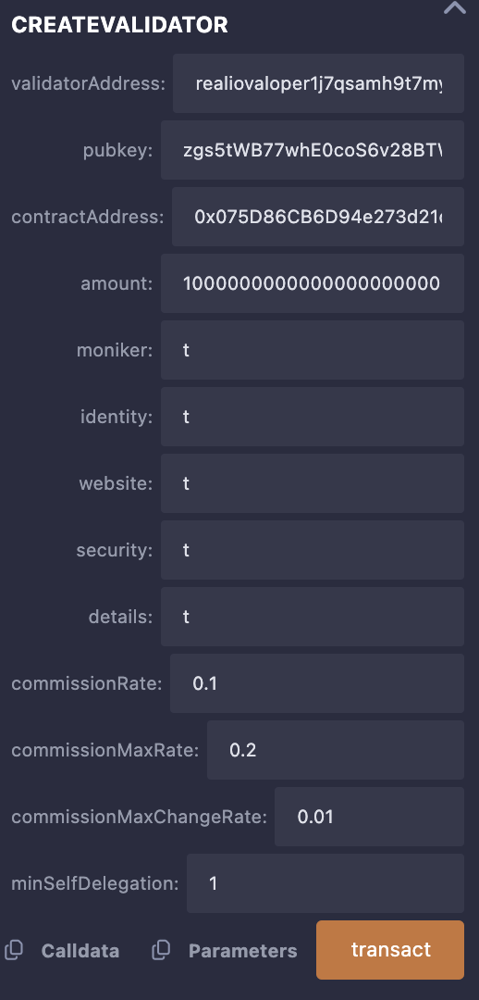
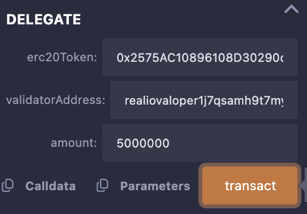

<!--
order: 7
-->

# Example

In this section we provide an example of how to interact with the multi-staking module using both EVM precompiles and cli.

## Create a validator using ERC20 token

We can call through `createValidator` precompile to create a validator using ERC20 token.



Or through `create-evm-validator` cli command.

```bash
realio-networkd tx multi-staking validator.json --from $KEY_NAME
```

Where `validator.json` look like:

```json
{
    "pubkey": {"@type":"/cosmos.crypto.ed25519.PubKey","key":"o59HSLn72AEh0dy4XKmZsFRJQMWL6aRxUeYr+1V1GBU="},
    "contract-address": "0x9b81cFe34C25131DaE2248c5e508829a3b52518b",
    "amount": "10000000000000000000",
    "moniker": "myvalidator",
    "identity": "optional identity signature (ex. UPort or Keybase)",
    "website": "validator's (optional) website",
    "security": "validator's (optional) security contact email",
    "details": "validator's (optional) details",
    "commission-rate": "0.1",
    "commission-max-rate": "0.2",
    "commission-max-change-rate": "0.01",
    "min-self-delegation": "1"
}
```

## Delegate

We can call through `delegate` precompile to delegate ERC20 tokens to a validator.



Or through `delegate-evm` cli command.

```bash
realio-networkd tx multi-staking delegate-evm [validator-addr] [contract-addr] [amount] --from $KEY_NAME
```

Example:

```bash
realio-networkd tx multi-staking delegate-evm cosmosvaloper1... 0x9b81cFe34C25131DaE2248c5e508829a3b52518b 1000000000000000000 --from $KEY_NAME
```

## Undelegate

We can call through `undelegate` precompile to undelegate ERC20 tokens from a validator.


Or through `unbond-evm` cli command.

```bash
realio-networkd tx multi-staking unbond-evm [validator-addr] [contract-addr] [amount] --from $KEY_NAME
```

Example:

```bash
realio-networkd tx multi-staking unbond-evm cosmosvaloper1... 0x9b81cFe34C25131DaE2248c5e508829a3b52518b 1000000000000000000 --from $KEY_NAME
```

## Cancel Unbonding

We can call through `cancelUnbondingDelegation` precompile to cancel unbonding delegation and re-delegate ERC20 tokens back to a validator.


Or through `cancel-unbond-evm` cli command.

```bash
realio-networkd tx multi-staking cancel-unbond-evm [validator-addr] [contract-addr] [amount] [creation-height] --from $KEY_NAME
```

Example:

```bash
realio-networkd tx multi-staking cancel-unbond-evm cosmosvaloper1... 0x9b81cFe34C25131DaE2248c5e508829a3b52518b 1000000000000000000 12345 --from $KEY_NAME
```
